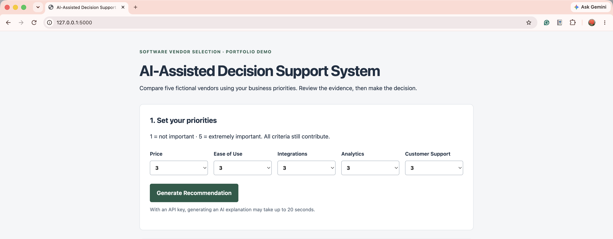
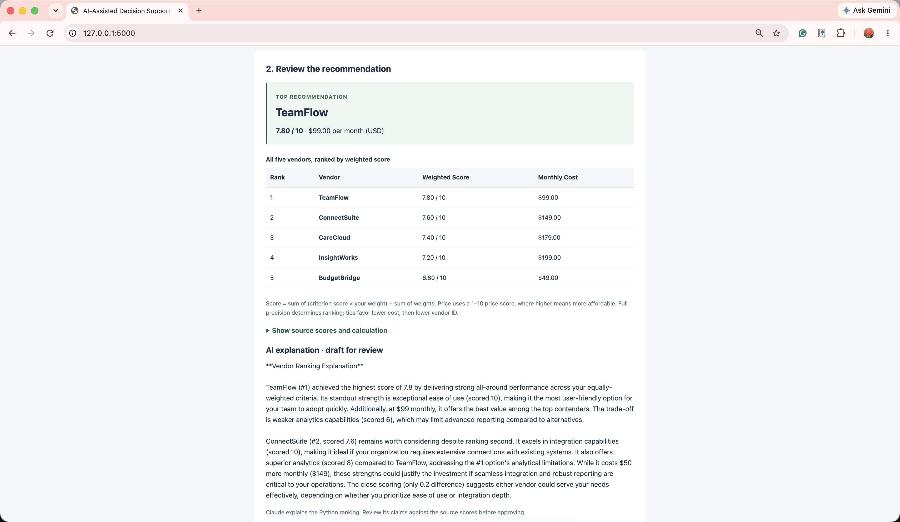
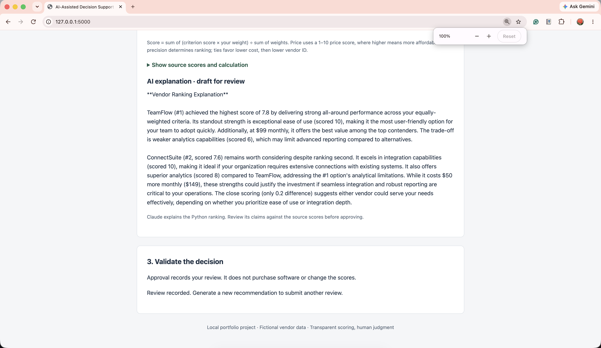

# AI-Assisted Decision Support System

A small, local **Software Vendor Selection Decision Support System** built for an entry-level Business/Data Analyst portfolio. Five fictional vendors are stored in SQLite. User priorities become a transparent ranking; Claude optionally drafts an explanation, and a person approves or flags the result.

## Screenshot walkthrough

These screenshots show a run with all five priority weights set to **3**. TeamFlow ranks first at **7.80/10**, with a monthly cost of **$99**.

### 1. Set business priorities



### 2. Compare the vendor ranking



### 3. Review the AI explanation and record human validation



The explanation is a draft for human review. These user-provided screenshots demonstrate the visible workflow, not a formal usability study.

## Business problem

A company needs to compare software vendors with different prices and capabilities. A repeatable scoring method makes the trade-offs visible and reduces inconsistent, undocumented decisions. This is a demonstration, not a validated procurement tool: vendor scores are fictional, and there are no budget exclusions, compliance checks, or real customer evaluations.

## Features

- One server-rendered Flask page; five priority weights from 1 to 5.
- SQLite vendor data, automatically created and seeded on first startup.
- All vendors ranked on a 1–10 scale, with monthly USD cost and source scores.
- Optional Claude explanation of the fixed top three; numerical results work without a key or when the API fails.
- Approve / Needs Review decisions persisted in SQLite with UTC timestamps.
- Server-side validation, signed sessions, form tokens, and parameterized feedback inserts.
- No JavaScript framework, machine learning, authentication, Docker, or hosting.

## Technologies

Python 3.10+, Flask, SQLite (Python standard library), HTML/CSS, Anthropic Python SDK, and python-dotenv. Flask's signed session stores the current weights and explanation; SQLite stores vendors and review decisions. No external service is used except Claude when configured.

## Setup and run

From this project directory:

```sh
python3 -m venv .venv
source .venv/bin/activate
python -m pip install -r requirements.txt
cp .env.example .env
python app.py
```

Open http://127.0.0.1:5000 in your browser. On Windows, activate with `.venv\Scripts\activate` and copy using `copy .env.example .env`.

Put your key in the `.env` file next to `app.py`:

```dotenv
ANTHROPIC_API_KEY=your_actual_key_here
ANTHROPIC_MODEL=claude-sonnet-4-5
```

Leave the key blank to demo numerical scoring without AI. The model is configurable for your account's available models. `.env` is excluded from Git; never put keys in HTML or commit them. Optional `SECRET_KEY` keeps sessions valid across restarts; otherwise restarting resets browser review state, while database feedback remains saved. Run locally with debug disabled. Stop with Ctrl+C.

`vendors.db` is created beside `app.py` on startup. Starting the app again preserves vendor data and feedback. The database is generated locally and excluded from Git; verification feedback was tested in a temporary database.

## SQL database schema

```sql
CREATE TABLE vendors (
    id INTEGER PRIMARY KEY,
    name TEXT NOT NULL UNIQUE,
    monthly_cost REAL NOT NULL CHECK (monthly_cost >= 0),
    price_score INTEGER NOT NULL CHECK (price_score BETWEEN 1 AND 10),
    ease_of_use_score INTEGER NOT NULL CHECK (ease_of_use_score BETWEEN 1 AND 10),
    integration_score INTEGER NOT NULL CHECK (integration_score BETWEEN 1 AND 10),
    analytics_score INTEGER NOT NULL CHECK (analytics_score BETWEEN 1 AND 10),
    support_score INTEGER NOT NULL CHECK (support_score BETWEEN 1 AND 10)
);
CREATE TABLE feedback (
    id INTEGER PRIMARY KEY,
    vendor_name TEXT NOT NULL,
    decision TEXT NOT NULL CHECK (decision IN ('approved', 'needs_review')),
    timestamp TEXT NOT NULL DEFAULT CURRENT_TIMESTAMP
);
```

`CURRENT_TIMESTAMP` records UTC. The ranking reads `SELECT * FROM vendors`. Feedback uses placeholders, not SQL string interpolation:

```sql
INSERT INTO feedback (vendor_name, decision) VALUES (?, ?);
SELECT * FROM feedback ORDER BY id DESC;
```

Inspect stored feedback from the project directory:

```sh
python -c "import sqlite3; db = sqlite3.connect('vendors.db'); print(db.execute('SELECT * FROM feedback ORDER BY id DESC').fetchall()); db.close()"
```

## Scoring formula

```text
weighted_score = (
    price_score       * price_weight
  + ease_of_use_score * ease_weight
  + integration_score * integration_weight
  + analytics_score   * analytics_weight
  + support_score     * support_weight
) / sum_of_all_five_weights
```

Weights must be whole numbers from 1 to 5. Every vendor criterion score is from 1 to 10, with higher being better. Price uses `price_score`, **not raw monthly cost**. Cost is displayed for context; it is not a spending cap. The five fictional score profiles are defined in `VENDORS` in `app.py` and inserted into SQLite only when the vendor table is empty.

Sort by the full-precision weighted score descending. Exact ties favor lower monthly cost, then lower vendor ID. Display two decimal places, so close scores can look tied even if they are not. The UI exposes source values and the winning calculation.

### Demo weights

Price **2**, Ease of Use **2**, Integrations **5**, Analytics **5**, Customer Support **3**.

Expected ranking:

| Rank | Vendor | Weighted score | Monthly USD |
| --- | --- | --- | --- |
| 1 | ConnectSuite | 8.06 | $149.00 |
| 2 | InsightWorks | 7.88 | $199.00 |
| 3 | CareCloud | 7.41 | $179.00 |
| 4 | TeamFlow | 7.35 | $99.00 |
| 5 | BudgetBridge | 5.82 | $49.00 |

ConnectSuite's calculation is `(6×2 + 7×2 + 10×5 + 8×5 + 7×3) / 17 = 137/17`. Then try all weights at 3: TeamFlow wins with 7.80. This shows how a change in business priorities changes the result.

## Why deterministic scoring instead of letting AI choose?

The formula is reproducible, easy to explain, and auditable. The same vendor data and weights produce the same ordering. AI-generated text can vary or contain errors, so it cannot determine or update scores. This is a rules-based decision support tool, not a trained predictive model.

## How Claude is used

After ranking, the server sends Claude the user's weights and top three vendors in fixed order, including their criterion scores, weighted scores, and monthly costs. The official SDK uses `Anthropic().messages.create(...)`, as described in the [Anthropic Messages API documentation](https://platform.claude.com/docs/en/build-with-claude/working-with-messages).

The prompt requests a brief explanation of why #1 won, one strength, one trade-off, and why #2 might still deserve consideration. The response is rendered as escaped plain text and never parsed into ranking data. A prompt cannot guarantee accurate prose: the draft is labeled for human review, while the numerical ranking remains authoritative. Missing keys, API errors, and incomplete output produce an unavailable message. Calls have a 20-second timeout and no retries to keep this local demo responsive. A configured API key may incur Anthropic usage charges.

## Human validation approach

The user reviews the ranking and explanation, then chooses **Approve Recommendation** or **Reject / Needs Review**. The server derives the top vendor from the session's weights instead of trusting a hidden vendor-name input. It records the vendor name, decision (`approved` or `needs_review`), and timestamp in SQLite. A confirmation appears after saving. Refreshing the result does not reinsert feedback; generating a new recommendation allows a new review.

Feedback demonstrates a human checkpoint; it does not automatically retrain, adjust scores, or purchase software. With no authentication or stored weight history, this is a simple review log, not a complete organizational audit trail. Each browser session has one active recommendation.

## UX testing approach and validation

Use the eight manual checks in `UX_TESTING.md`. They are a checklist for future hands-on testing, not a claim that real users were recruited. Ask a peer to complete the workflow and record observations before making any usability-study claim.

Implementation verification passed: Python syntax; all 3,125 valid weight combinations; exact demo scores and tie behavior; invalid and missing weights; Flask test-client rendering and form-token validation; missing-key behavior and mocked Claude success/error/incomplete-output paths; escaped AI text; and persisted approve/reject rows with timestamps in a temporary SQLite file. Reinitialization preserved those rows. The actual local Flask server was also opened in a browser, where the demo inputs produced the expected five-vendor ranking and the layout was visually inspected. The locally initialized database was verified to contain exactly five vendors and zero test reviews. Tested with Python 3.11.4, Flask 3.1.3, anthropic 0.125.0, and python-dotenv 1.2.3. The real Claude service requires your key and was not exercised during implementation. Test feedback is kept out of the delivered demo database.

## Simple architecture

```text
User Criteria
      |
      v
SQLite Vendor Data
      |
      v
Weighted Scoring
      |
      v
Vendor Ranking
      |
      v
Claude Explanation
      |
      v
Human Approval
```

`app.py` contains database setup, validation, scoring, Claude integration, and the two routes. `templates/index.html` renders the single page. `static/style.css` styles it. These are deliberately kept together so the whole workflow is easy to trace.

## Four likely interview questions

**1. Why did you use a weighted average?**  
It translates user priorities into a repeatable comparison and keeps the final score on the same 1–10 scale as the source data.

**2. What does AI do in this project?**  
Claude drafts an explanation of the fixed ranking. Python makes the ranking, so the core recommendation works even if AI is unavailable.

**3. How is SQL used?**  
SQLite stores vendor attributes and human review decisions. The app queries vendors and inserts feedback using parameterized SQL.

**4. How would you validate or improve it?**  
Verify scoring and persistence, run the manual UX checklist with a peer, and then validate vendor scores with stakeholders. A later version could record review reasons and the exact weights used, if the business needs that audit detail.
